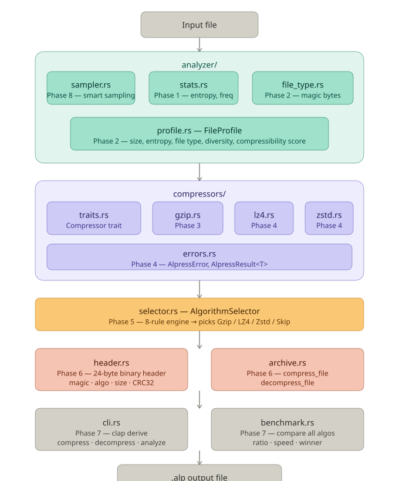

# Alpress

An adaptive file compression tool written in Rust that automatically picks the best compression algorithm based on your file's content — no configuration needed.



## What it does

Alpress analyzes any file and intelligently selects between Gzip, LZ4, and Zstd based on entropy, file type, and size. It compresses to a custom `.alp` format that stores metadata and verifies integrity with a CRC32 checksum on every decompress.

## Features

- Automatic algorithm selection — no flags to tune
- Skips compression for already-compressed files (JPEG, ZIP, MP4, etc.)
- CRC32 integrity verification on every decompress
- Smart sampling for large files — fast profiling without reading every byte
- Built-in benchmark command to compare all algorithms side by side
- Clean CLI with `--verbose` mode showing full analysis reasoning

## Installation

```bash
git clone https://github.com/yourusername/Alpress.git
cd Alpress
cargo install --path .
```

Requires Rust 1.70+ — install from [rustup.rs](https://rustup.rs)

## Usage

```bash
# Compress a file (auto-picks best algorithm)
alpress compress myfile.txt

# Compress with verbose output — shows analysis + decision reasoning
alpress compress myfile.txt --verbose

# Decompress
alpress decompress myfile.txt.alp

# Analyze a file without compressing
alpress analyze myfile.txt

# Benchmark all algorithms side by side
alpress benchmark myfile.txt
```

## How it works

Alpress runs every file through three layers:

**1. Analysis layer** — reads the file (or a smart sample for large files), calculates Shannon entropy, detects the file type from magic bytes, and builds a `FileProfile`.

**2. Decision engine** — applies 8 ordered rules to the profile and picks the best algorithm. Skips compression entirely for already-compressed formats or high-entropy data.

**3. Compression layer** — runs the chosen algorithm and writes a `.alp` file containing a 24-byte metadata header followed by the compressed data. Every decompress verifies the CRC32 checksum.

```
Any file  ──►  Analysis layer  ──►  Decision engine  ──►  Compression layer  ──►  .alp file
               · Sampler             · Entropy                · Gzip
               · Stats               · File type              · LZ4
               · File type detect    · Size                   · Zstd
               · FileProfile         └─► algorithm            · Skip (if not worth it)
```

### Algorithm selection rules

| Condition | Algorithm chosen |
|---|---|
| Already compressed (JPEG, ZIP, MP4…) | Skip |
| Entropy > 7.5 (encrypted / random) | Skip |
| File < 4 KB | Gzip (default) |
| Compressibility ≥ 75% | Zstd level 19 |
| Compressibility ≥ 50% | Zstd level 3 |
| File > 50 MB, moderate compressibility | LZ4 |
| Low compressibility | Gzip (fast) |
| Very low compressibility | Skip |

### .alp file format

Every `.alp` file starts with a 24-byte header:
Offset  Size  Field
──────  ────  ─────────────────────────────────
0       4     Magic bytes: "ALPS"
4       1     Format version
5       1     Algorithm ID
6       8     Original size (u64, little-endian)
14      4     CRC32 checksum of original data
18      6     Reserved

## Project structure
src/
├── main.rs          — CLI entry point (clap)
├── cli.rs           — Command definitions
├── stats.rs         — Entropy + byte frequency
├── errors.rs        — AlpressError, AlpressResult<T>
├── selector.rs      — Algorithm decision engine
├── header.rs        — Binary .alp format
├── archive.rs       — compress_file / decompress_file
├── benchmark.rs     — Algorithm comparison table
├── sampler.rs       — Smart file sampling
└── analyzer/
├── file_type.rs — Magic byte detection
└── profile.rs   — FileProfile struct

## Dependencies

| Crate | Purpose |
|---|---|
| `flate2` | Gzip compression |
| `lz4` | LZ4 compression |
| `zstd` | Zstandard compression |
| `crc32fast` | Checksum verification |
| `clap` | CLI argument parsing |

## Running tests

```bash
cargo test
```

## Built with

Rust — learning project built across 8 phases, from basic file I/O to a full adaptive compression system.

## License

MIT